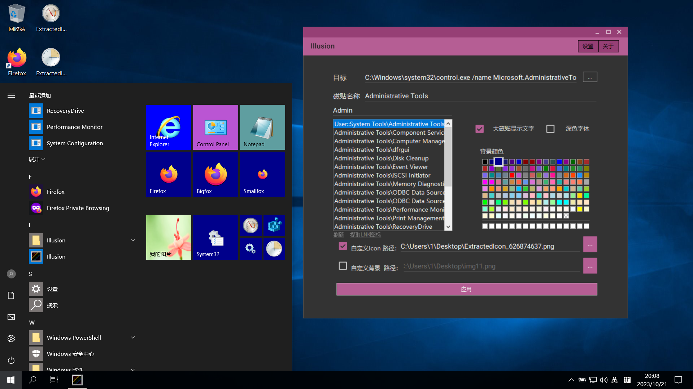

Custom Your Windows 10 Tiles
==================

Illusion is a tool to create, customize and manage your Start menu tiles.

Features:

* Works on 20H2 or above!
* Creating tiles for ANY apps and files
* Support for UWP Applications
* Setting background color for tiles, or use your custom background
* Custom tile icon image and size

You can check [Releases](https://github.com/rHanbowChic/Illusion2/releases) for the latest builds.

HeavenlyThread
------------

Command line version of Illusion.

Syntax: .\HeavenlyThread \[TileName\] \[TargetPath\] \[r\] \[g\] \[b\] (on|off) (dark|light) ("None"|AppxPath) <CustomPicturePath>

